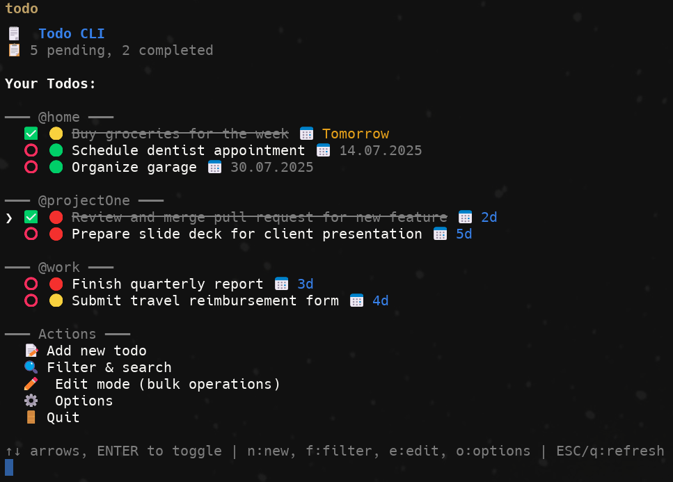

# Todo CLI - Natural Language Edition

A powerful, interactive command-line todo application with natural language input parsing. Create todos with priorities, tags, and due dates using intuitive syntax like `!Fix bug (2d) @work`. Features advanced keyboard shortcuts, in-place toggling, and sophisticated task organization.



## ✨ Features

- **Natural Language Input** - Create todos with intuitive syntax: `!Fix critical bug (2d) @work`
- **Priority System** - Use `!` for high priority, `_` for low priority, or medium by default
- **Flexible Tags** - Organize with `@work`, `@home`, `@project` tags for perfect categorization
- **Smart Due Dates** - Set dates with `(2d)`, `(tomorrow)`, `(2025-07-01)`, or other natural formats
- **Instant Keyboard Shortcuts** - Press `n`, `f`, `e`, `o` for quick actions without menu navigation
- **Perfect In-Place Toggling** - Toggle todo status with no screen refresh or cursor movement
- **Visual Grouping** - Todos automatically grouped by tags with smart priority/date sorting
- **Advanced Filtering** - Filter by text, tags, priority, status, or overdue items
- **Bulk Operations** - Edit mode for managing multiple todos simultaneously
- **Persistent Storage** - Todos saved automatically in `~/.todos.json`
- **Beautiful Design** - Colorful, emoji-rich interface with clear visual indicators
- **Debug Mode** - Use `--debug` flag for troubleshooting and development

## 🚀 Installation

### Global Installation (Recommended)

```bash
npm install -g @nosekbk/todo-cli
```

Then use anywhere:
```bash
todo
```

### Local Installation

```bash
npm install @nosekbk/todo-cli
npx todo-cli
```

### From Source

```bash
git clone https://github.com/bartekkustra/todo-cli.git
cd todo-cli
npm install
npm install -g .
```

## 🎮 Usage

Simply run `todo` to start the interactive interface:

```bash
todo
```

### Natural Language Todo Creation

Create todos using natural language syntax:

```bash
# Basic todo
Buy groceries

# High priority with due date
!Submit report (2d)

# Tagged with low priority
_Clean garage @home

# Complex example
!Fix critical bug (tomorrow) @work
```

**Syntax Elements:**
- `!` = High priority (🔴)
- `_` = Low priority (🟢)
- No prefix = Medium priority (🟡)
- `@tag` = Add tags like `@work`, `@home`, `@project`
- `(date)` = Set due dates: `(2d)`, `(tomorrow)`, `(2025-07-01)`

### Main Interface

The default view shows your todos grouped by tags:

- **Select any todo** → Toggle completion status (✅/⭕) instantly
- **Press `n`** → Add new todo with natural language input
- **Press `f`** → Filter todos by text, tags, priority, or status
- **Press `e`** → Edit mode for bulk operations
- **Press `o`** → Options menu with statistics and settings
- **Press `q` or `ESC`** → Refresh view or exit

### Keyboard Shortcuts

**Main Interface:**
- **↑↓ Arrow Keys** - Navigate through todos
- **Enter** - Toggle todo completion status instantly
- **`n`** - Add new todo (natural language input)
- **`f`** - Filter & search todos
- **`e`** - Enter edit mode for bulk operations
- **`o`** - Open options menu
- **`q` / `ESC`** - Refresh view or exit
- **`Ctrl+C`** - Quick exit

**Edit Mode:**
- **Space** - Select/deselect multiple todos
- **Enter** - Apply bulk action to selected todos
- **`ESC`** - Return to main view

**Debug Mode:**
- **`--debug`** - Enable debug output for troubleshooting

### Edit Mode (Bulk Operations)

1. Press **`e`** or select **✏️ Edit mode**
2. Use **Space** to select multiple todos
3. Choose action:
   - **✅ Mark all as completed**
   - **⭕ Mark all as pending**
   - **🔴 Set priority to High**
   - **🟡 Set priority to Medium**
   - **🟢 Set priority to Low**
   - **🗑️ Delete all selected**

### Filtering & Search

1. Press **`f`** to open filter menu
2. Choose filter type:
   - **Text search** - Find todos containing specific text
   - **Tag filter** - Show only todos with specific tags
   - **Priority filter** - Filter by High/Medium/Low priority
   - **Status filter** - Show completed or pending todos
   - **Overdue filter** - Show only overdue items

## 📁 Data Storage

Todos are automatically saved to `~/.todos.json` in your home directory. The file is created automatically and persists between sessions.

## 🛠️ Development

### Prerequisites

- Node.js 16+ (see `.nvmrc` for exact version)
- npm

### Setup

```bash
git clone https://github.com/bartekkustra/todo-cli.git
cd todo-cli
nvm use  # If using nvm
npm install
```

### Running Locally

```bash
npm start
# or
node bin/todo.js

# With debug mode
npm run debug
# or
node bin/todo.js --debug
```

### Project Structure

```
todo-cli/
├── bin/
│   └── todo.js         # Main CLI application with natural language parsing
├── lib/
│   └── todoManager.js  # Todo data management & persistence
├── CHANGELOG.md        # Version history and feature changes
├── LICENSE             # MIT license
├── package.json        # Package configuration (v1.1.3)
├── README.md           # This documentation
├── .gitignore          # Git ignore rules
└── .nvmrc              # Node version specification (22+)
```

## 📦 Dependencies

- **inquirer** - Interactive command line prompts
- **chalk** - Terminal colors and styling

## 🔧 Configuration

No configuration needed! The app works out of the box with sensible defaults.

## 🐛 Troubleshooting

### Permission Issues
If you get permission errors during global installation:
```bash
sudo npm install -g @nosekbk/todo-cli
```

### Node Version Issues
Make sure you're using Node.js 22+:
```bash
node --version
```

### Data File Issues
If todos aren't persisting, check that `~/.todos.json` is writable:
```bash
ls -la ~/.todos.json
```

## 🤝 Contributing

1. Fork the repository
2. Create a feature branch (`git checkout -b feature/amazing-feature`)
3. Commit your changes (`git commit -m 'Add amazing feature'`)
4. Push to the branch (`git push origin feature/amazing-feature`)
5. Open a Pull Request

## 📝 License

MIT License - see the [LICENSE](LICENSE) file for details.

## 🙏 Acknowledgments

- Built with [Inquirer.js](https://github.com/SBoudrias/Inquirer.js) for beautiful CLI prompts
- Styled with [Chalk](https://github.com/chalk/chalk) for terminal colors
- Inspired by the need for a simple, visual todo manager

---

**Happy task managing!** 🗒️✨